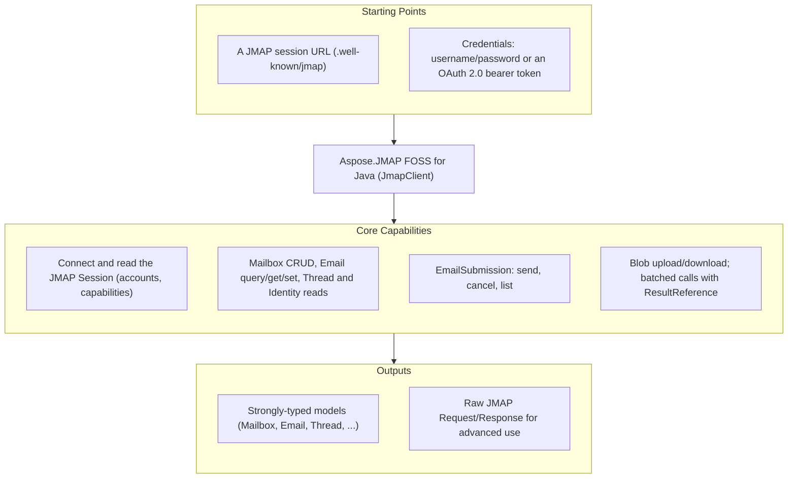

# Aspose.JMAP FOSS for Java

[](LICENSE) [](https://central.sonatype.com/artifact/com.aspose/aspose-jmap-foss) [](https://github.com/aspose-email-foss/Aspose.JMAP-FOSS-for-Java/graphs/contributors)

[](https://products.aspose.org/jmap/java/)

Aspose.JMAP FOSS for Java is a free, open source JMAP client library for Java 17 — for talking
to a [JMAP](https://jmap.io) mail server over HTTP:
[RFC 8620](https://www.rfc-editor.org/rfc/rfc8620) Core (session, `Core/echo`, blob
upload/download, batched method calls) and [RFC 8621](https://www.rfc-editor.org/rfc/rfc8621)
Mail (Mailbox/Email/Thread/Identity/SearchSnippet) plus EmailSubmission. Its public API is
styled after Aspose.Email's client conventions — a client object plus a builder-style options
object, a `connect()` call that returns the session, and strongly-typed message and folder
models.

**This is an official Aspose open-source project. It does not contain or reference Aspose.Email
proprietary source.** The library is generated from hand-authored JMAP protocol specifications.

## Navigation

- [At a Glance](#at-a-glance)
- [Key Capabilities](#key-capabilities)
- [Installation](#installation)
- [Dependencies](#dependencies)
- [Quick Start](#quick-start)
- [Additional Examples](#additional-examples)
- [API Reference](#api-reference)
- [Documentation & Resources](#documentation--resources)
- [Scope and Limitations](#scope-and-limitations)
- [Development and Testing](#development-and-testing)
- [License](#license)

## At a Glance



## Key Capabilities

- **Connect and inspect the session** — `client.connect()` fetches `/.well-known/jmap` and
  returns the `Session` (account ids, `capabilities`, `apiUrl`, `uploadUrl`, `downloadUrl`).
- **Mailboxes** — `listMailboxes()`, `getMailbox()`, `createMailbox()`, `deleteMailbox()` wrap
  `Mailbox/get`, `Mailbox/query`, and `Mailbox/set`.
- **Messages** — `listMessages()`, `fetchMessage()`, `moveMessage()`, `setMessageKeyword()`,
  `deleteMessage()` over `Email/query`, `Email/get`, and `Email/set`.
- **Identities** — `listIdentities()` over `Identity/get`.
- **Sending** — `send()`, `cancelSend()`, `listSubmissions()` wrap `EmailSubmission/set` and
  `EmailSubmission/get`.
- **Blobs** — `uploadBlob()` / `downloadBlob()` for `/upload` and `/download`.
- **Batching** — `sendRequest()` sends any list of `Invocation`s in one HTTP round trip, with
  `ResultReference` ([RFC 8620 §3.7](https://www.rfc-editor.org/rfc/rfc8620#section-3.7)) to
  chain one call's result into the next.
- **Pluggable transport** — the client takes a `JmapTransport`; every unit test supplies a fake,
  so no test needs a network.
- **OAuth 2.0** — `JmapClientOptions.Builder.bearerToken(...)`
  ([RFC 6750](https://www.rfc-editor.org/rfc/rfc6750)) as an alternative to HTTP Basic.

## Installation

No artifact has been published to Maven Central yet; until it is, build and install the library
locally (see [Development and Testing](#development-and-testing)). The intended coordinates are
`com.aspose:aspose-jmap-foss`:

```xml
<dependency>
  <groupId>com.aspose</groupId>
  <artifactId>aspose-jmap-foss</artifactId>
  <version>0.1.0</version>
</dependency>
```

## Dependencies

### Required Package Dependencies

JSON handling uses a small vendored/generated model layer plus the Java standard library; see
`pom.xml` for the exact `<dependencies>` the generated code compiles against.

### Native and System Requirements

- Java 17 or later. **No local JDK or Maven is required** — see
  [Development and Testing](#development-and-testing): the build runs inside a throwaway
  `maven:3.9-eclipse-temurin-17` Docker container, so only Docker is needed.

### Development Dependencies

- JUnit — the unit-test framework, declared test-scope in `pom.xml`.

## Quick Start

```java
import com.aspose.jmap.JmapClient;
import com.aspose.jmap.JmapClientOptions;
import com.aspose.jmap.Session;

JmapClientOptions options = new JmapClientOptions.Builder()
    .sessionUrl("https://jmap.example.test/.well-known/jmap")
    .username("user@example.test")
    .password("secret")
    .build();
JmapClient client = new JmapClient(options);
Session session = client.connect();
```

## Additional Examples

### OAuth 2.0 bearer token authentication

Authenticate with an OAuth 2.0 bearer token
([RFC 6750](https://www.rfc-editor.org/rfc/rfc6750)) instead of username/password — when
`.bearerToken(...)` is set to a non-empty value it takes precedence and the client sends
`Authorization: Bearer <token>`:

```java
JmapClientOptions options = new JmapClientOptions.Builder()
    .sessionUrl("https://jmap.example.test/.well-known/jmap")
    .bearerToken("eyJhbGciOiJSUzI1NiIsInR5cCI6IkpXVCJ9...")
    .build();
JmapClient client = new JmapClient(options);
Session session = client.connect();
```

<details>
<summary>Batching requests with ResultReference</summary>

Multiple method calls can be batched into a single HTTP round trip via `sendRequest`, using a
`ResultReference` ([RFC 8620 §3.7](https://www.rfc-editor.org/rfc/rfc8620#section-3.7)) to chain
a later call to an earlier one's result without a second request:

```java
Invocation query = new Invocation("Email/query", Map.of("accountId", accountId), "c1");
Invocation get = new Invocation(
        "Email/get",
        Map.of(
                "accountId", accountId,
                "#ids", new ResultReference("c1", "Email/query", "/ids")),
        "c2");
JmapResponseEnvelope resp = client.sendRequest(List.of(query, get), List.of("urn:ietf:params:jmap:mail"));
```

</details>

## API Reference

`JmapClient` (with `JmapClientOptions`) is the single entry point; the model classes `Session`,
`Mailbox`, `Email`, `EmailAddress`, `Thread`, `Identity`, `EmailSubmission`, and `SearchSnippet`
mirror the JMAP objects one-to-one, and `Invocation` / `ResultReference` model raw method calls
for `sendRequest`. Errors surface as `JmapNetworkException` (transport) and
`JmapProtocolException` (a JMAP method-level error); per-item `Set` failures are returned as
data on the result rather than thrown.

The full protocol/API reference, rendered from the same specs that drive generation, is
[`docs/api-reference.md`](../../docs/api-reference.md) at the repository root.

## Documentation & Resources

- **[Getting started guide](https://docs.aspose.org/jmap/java/)** — installation and walkthroughs.
- **[API reference](https://reference.aspose.org/jmap/java/)** — browsable reference for the public types.
- **[How-to guides & FAQ](https://kb.aspose.org/jmap/java/)** — task-focused answers.
- **[Protocol/API reference](../../docs/api-reference.md)** — the in-repo reference rendered from the specs.
- **[Changelog](../../CHANGELOG.md)**, **[Contributing guide](../../CONTRIBUTING.md)**, **[Security policy](../../SECURITY.md)**.
- Found a bug or have a feature request? [Open an issue](https://github.com/aspose-email-foss/Aspose.JMAP-FOSS-for-Java/issues) on GitHub.

## Scope and Limitations

- **Protocol**: JMAP Core (RFC 8620) and JMAP Mail (RFC 8621: Mailbox/Email/Thread/Identity/SearchSnippet)
  plus EmailSubmission.
- **Out of scope for v1**:
  - Push / `EventSource` streaming — the type exists but is a stub/no-op.
  - JMAP for Calendars and Contacts.
  - `Date`/`UTCDate` values are kept as raw RFC 3339 strings (no `java.time` parsing) to avoid
    timezone-conversion bugs.
- Unit tests run against a fake `JmapTransport` with mocked responses — no live JMAP server is
  required. A Docker-based live-server integration suite (Stalwart Mail Server) lives in
  [`infra/integration/`](../../infra/integration/README.md).

## Development and Testing

This project's own tooling never assumes a JDK or Maven is installed on your machine: both the
codegen pipeline's validator
(`agent/src/jmap_codegen_agent/validators/java_validator.py`) and the commands below run
everything inside a throwaway `maven:3.9-eclipse-temurin-17` Docker container. Requires only
Docker.

```bash
git clone https://github.com/aspose-email-foss/Aspose.JMAP-FOSS-for-Java.git
cd Aspose.JMAP-FOSS-for-Java
docker run --rm -v "$PWD:/workspace" -w /workspace maven:3.9-eclipse-temurin-17 mvn -B compile
docker run --rm -v "$PWD:/workspace" -w /workspace maven:3.9-eclipse-temurin-17 mvn -B test
```

(On Windows PowerShell, replace `$PWD` with `${PWD}`; on cmd.exe, use `%cd%`.) The first run
downloads Maven Central dependencies into the container and discards them on exit unless you also
mount a volume for `~/.m2` (`-v aspose-jmap-foss-java-m2:/root/.m2`) to cache them across runs —
see [`infra/integration/README.md`](../../infra/integration/README.md) for the same pattern
applied to the live-server integration tests, and [`agent/docs/runbook.md`](../../agent/docs/runbook.md)
for the full command reference.

If you do have a local JDK 17+ and Maven installed, `mvn compile` / `mvn test` work the same way
without Docker — the Docker-only constraint is this project's convention for keeping the
*codegen agent's* host toolchain-free, not a requirement of the generated library itself.

## License

This project is licensed under the [MIT License](LICENSE). The MIT License permits use, copying,
modification, distribution, sublicensing, and commercial use, provided its copyright and
permission notice are retained. The software is provided without warranty.
